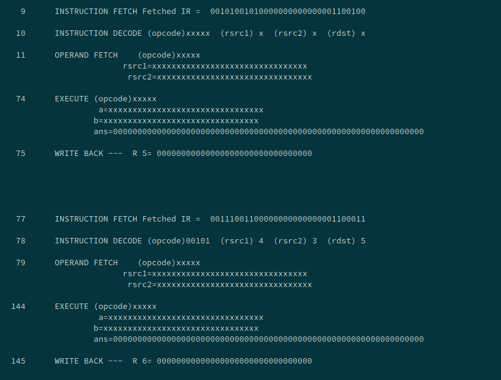
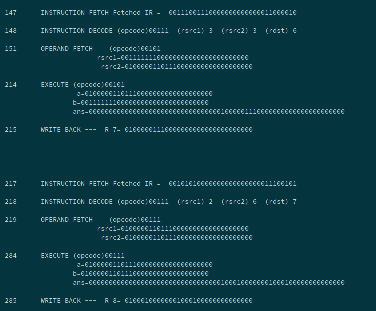

## 32-bit Pipelined Processor

This repo contains a 32-bit pipelined processor (without control circuit), written in verilog. 


### Usage

```
$ cd processor
$ iverilog -o pro processor_tb.v
$ vvp pro
```

### Output Screesnshots






